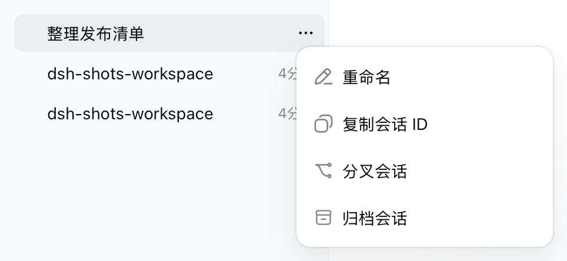
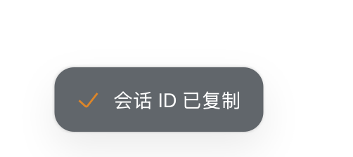
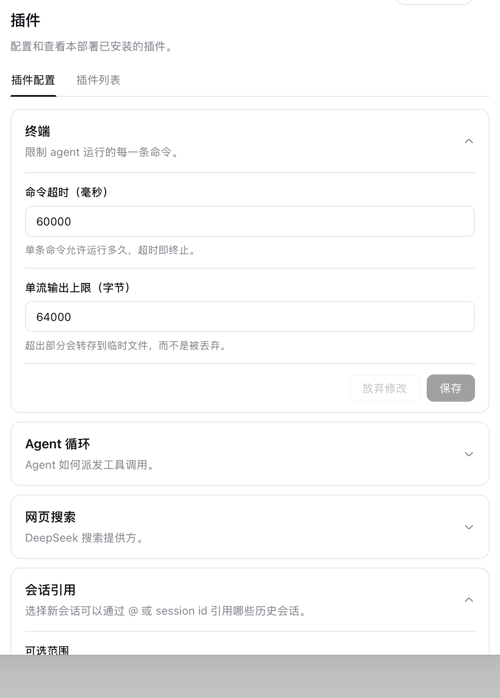
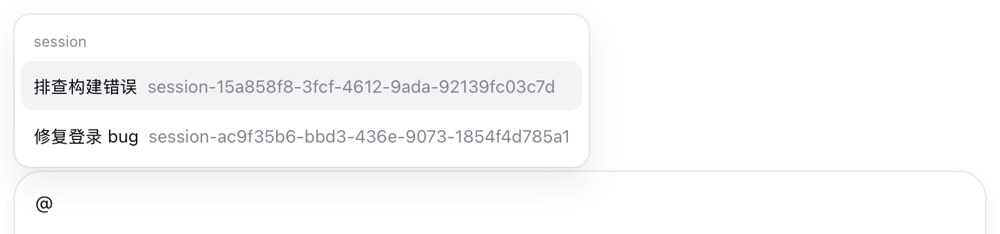

# dsh-sessions

`dsh-sessions` 是 [DeepSeek Harness](https://github.com/deepseek-ai/deepseek-harness)（DSH）的 Web 插件：把其他会话作为有界、只读、带来源的快照引用进当前会话。浏览器半提供 `@` 触发源、引用范围设置卡片，并 vendor `ui-workspace` 以在会话行 `⋯` 菜单加入「复制会话 ID」；宿主半通过 `agent/pre-step` 解析 mention，并调用官方 `ctx.sessionReferenceResolver.prepare()` 产出快照。此外，它还在当前会话内提供 Codex 式的**选区引用前文**：选中聊天正文即可把这段文本带回输入框，作为 `> ` 引用块发给模型。

## 功能

- `@` 候选：输入 `@` 时列出可引用的历史会话，排序沿用 `sessionReferenceResolver.listCandidates()`（同 cwd、无 cwd、其他 cwd）。候选 label 取日志支撑的最新标题，缺失时回退到会话 id。
- 裸 session id：消息里的 `session-<uuid>` 直接解析为引用，只在两侧不是 `[A-Za-z0-9_-]` 的位置匹配。
- 手打 `@标题`：`allowPlainTitleMentions` 打开时，按候选标题做不区分大小写的精确匹配；唯一命中才解析，重名保持普通文本。
- 复制会话 ID：会话行 `⋯` 菜单新增「复制会话 ID」，复制 dsh 原生 session id；成功与失败都有 toast。
- 引用前文：在会话正文中选中文本会出现「添加到对话」按钮；添加后在选中句子上方出现带序号的聊天气泡，点气泡可为该引用添加/修改评论（取消/保存），发送时自动序列化为 `> ` 引用块 + 可选评论（详见[引用前文](#引用前文codex-式选区引用)）。

## 安装

```sh
dsh plugin --profile web add @wishp3/dsh-sessions
dsh --profile web
```

bundle patch 做两件事：`disabled: true` 关掉内置 `ui-workspace`，并插入 `session-reference` 与 `session-bridge` 两行。前者是官方快照语义层；后者同时声明 `dsh.bundle` 与 `dsh.client`，web loader 从同一行自动提供浏览器半。

DSH 插件通过 profile 安装、通过 bundle patch 参与组合，详见官方[插件管理文档](https://github.com/deepseek-ai/deepseek-harness/blob/master/apps/cli/reference/README.md#plugin-management)和[架构说明](https://github.com/deepseek-ai/deepseek-harness/blob/master/docs/architecture.md)。

## 与官方项目的关系

本项目是基于 [deepseek-ai/deepseek-harness](https://github.com/deepseek-ai/deepseek-harness) 构建的社区插件，不修改官方运行时：

- 快照语义完全复用官方 `@deepseek-ai/dsh-session-reference` 服务，本包只做 UI 触发源、路由与 `agent/pre-step` 接线。
- 浏览器半通过官方 `ctx.inputTriggers`、`settings.plugin.item`、`slots` 等服务接入 Web UI。
- `upstream/` 保留一份提交给官方仓库的工作区菜单槽位补丁；补丁合并后，本包会删除 vendor 并恢复内置 `ui-workspace`。

需要命令行运行或参与核心功能开发，请以官方仓库为准。

## 工作区界面

当前发布的 `ui-workspace` 没有会话行菜单扩展槽位，`upstream/0001-web-session-row-menu-slot.patch` 是提交给上游的补丁。本包因此 vendor 了 `ui-workspace` 的完整浏览器源码（`src/vendor/workspace/`），在 bundle patch 中禁用内置行，用自己的注册补上 `sidebar.workspaces` 与 `conversation.hero.workspace` 两个 slot，其余行为与内置实现一致。

复制走 `copyTextToClipboard()`：先在点击手势内同步 `document.execCommand('copy')`，失败再回退 `navigator.clipboard.writeText()`，任一后端接受即成功。结果 toast 在行组件本地渲染，4 秒后自动消失，zh/en 文案各一套。

| 会话行 `⋯` 菜单 | 复制成功 toast |
| --- | --- |
|  |  |

dsh 升级工作区 UI 后需同步 vendor 目录；`upstream/` 里的槽位补丁合并进上游后，可删除 vendor 并恢复内置 `ui-workspace`。

## 配置

Web UI：设置 → 插件 → 插件配置 → **会话引用**。卡片默认折叠，展开后可在「仅当前工作区 / 所有可见会话」之间切换，保存即写入宿主 settings。

api-proxy 的 settings 命名空间白名单不覆盖第三方包，因此卡片不注册官方 settings 槽，而是走本包自己的 `GET/POST /dsh-sessions/settings`；设置节持久化到 dsh `settings.yaml` 的 `dsh-sessions:` 段。



| 键 | 默认 | 作用 |
|---|---|---|
| `scope` | `workspace` | `workspace`：只能引用与目标会话同 cwd 的记录；`all`：引用本机 dsh 可见的全部持久化会话 |
| `allowBareSessionIds` | `true` | 解析消息中的裸 session id |
| `allowPlainTitleMentions` | `true` | 解析手打 `@标题` |
| `candidateLimit` | `50` | 预留：浏览器半目前固定请求 50 个候选 |
| `failureMode` | `passthrough` | preflight 成功后、pre-step 再次 prepare 失败时：`passthrough` 保留可读文本继续，`reject` 拒绝该步 |

`scope` 在卡片上改；其余键通过 `cordis.patch.yml` 或 profile 覆盖。

## 工作方式

### 引用前文（Codex 式选区引用）

「引用前文」让你像 Codex 一样，把当前会话里已经出现过的文本快速带回输入框，作为上下文发送给模型。它不跨会话，也不读取文件；它处理的是“这段对话里刚才说过/写过的内容”。

#### 使用步骤

1. 在聊天正文中选中一段文本（代码、自然语言均可）。选区上方出现「添加到对话」浮动按钮。
2. 点击按钮：
   - 引用文本先 `trim`，超过 16,000 Unicode 码点时截断并追加本地化截断标记；
   - 在草稿末尾插入一个 `dsh-sessions-quote` chip，输入框内显示「引用 N」小标签；
   - 同时在选中句子的第一行上方出现一个聊天气泡，显示该引用的序号。
3. 点击气泡：
   - 弹出评论卡片，输入框预填该引用已有的评论（没有则为空）；
   - 点「保存」把评论写回该引用的 chip，气泡上出现小圆点表示已有评论；
   - 点「取消」、Esc 或点击卡片外关闭，不改动任何内容。
4. 输入框上方出现引用条：
   - 列出当前草稿中所有引用 chip；
   - 每条显示「引用 N」、首行预览；
   - 可展开/收起查看全文，有评论的引用展开后会追加「评论」小节；
   - 可逐条移除（等价于在输入框里删除对应 chip），评论与气泡随引用一并移除。
5. 继续输入正文或直接发送。发送时每个 chip 被序列化为逐行 `> ` 前缀的 Markdown 引用块；有评论时在引用块后空一行追加评论，模型收到的就是引用内容加你的说明/追问。
6. 发送成功后草稿清空，引用条与气泡消失；如果引用被移除或手动删除 chip，它们也会同步消失。

#### 交互与实现细节

- **触发条件**：仅当选区位于会话正文（`[data-conversation-scroll]` 内）且不在输入区/引用条（`[data-composer-seat]` 内）时显示「添加到对话」按钮；空选区、输入阶段非 `plain` 时不显示。
- **气泡锚点**：添加引用前克隆选区 `Range`，气泡取 `range.getClientRects()[0]`（第一行）定位到句子上方；滚动与窗口缩放时重算位置。上游刷新导致节点卸载时该气泡会消失，重新引用即可恢复。
- **评论保存**：点气泡预填已有评论；保存走官方输入机「`slash/input-consume-token` 移除旧 chip + `slash/input-insert-reference` 同位插入新 chip」，两次调用之间用 `ctx.conversation.input.for(actx).state.getSnapshot()` 读取最新 draftRev；失败回滚旧 chip 并在卡片内提示重试。
- **插入位置**：统一追加到草稿末尾，插入后自动聚焦输入框并把光标放到末尾。
- **数据来源**：引用条不维护第二份状态，完全从官方输入机的 `input.occurrences` 过滤 `source === 'dsh-sessions-quote'` 派生。因此撤销、重做、复制、粘贴、手动删除 chip 都与引用条天然同步。
- **官方管线**：插入走 `slash/input-insert-reference`，移除走 `slash/input-consume-token`（span CAS），由 `InputMachine` 负责占位符、偏移维护与撤销历史。
- **序列化**：codec 的 `serialize(ref)` 返回逐行 `> ` 前缀引用块，有评论时追加一个空行和评论，并带换行分隔防止相邻 chip 粘连；`clipboardText` 同样带首尾换行，复制相邻 chip 也不会粘成一行。复制 chip 或草稿持久化后重载，引用以引用块文本形式保留。
- **`@` 菜单无干扰**：`dsh-sessions-quote` 是一个候选恒为空的 `@` 触发源，空分组不会渲染，因此不会污染已有的 `@` 会话候选菜单。

#### 模型看到的内容

模型不会看到 chip，只会看到一段普通 Markdown 引用；如果添加了评论，评论紧跟引用块：

```md
> 你选中的第一行
> 你选中的第二行

你的可选评论
```

引用块不带来源标注、不带「引用 N」标题；它就是你选中的原文（可能带截断标记）。评论就是普通文本行，同样不带额外标注。这不同于跨会话 `@` 引用的结构化快照：引用前文是纯浏览器端文本组装，日志中也不会额外写入结构化引用元数据。

#### 与跨会话 `@` 引用的区别

| 维度 | 引用前文 | 跨会话 `@` 引用 |
| --- | --- | --- |
| 来源范围 | 当前会话聊天正文 | 本机其他历史会话 |
| 是否经过宿主 `prepare()` | 否，纯浏览器端 | 是，宿主按 scope 过滤并生成快照 |
| 模型输入形态 | `> ` Markdown 引用块 | 独立的 `## Referenced sessions` 快照 + 可读 `@label` |
| 来源可追溯性 | 无结构化来源元数据 | 有 session id、label、cwd 等 |
| 是否受 65536 字节快照限制 | 否，受 16,000 码点单条限制 | 是，受 `maxReferenceBytes` 限制 |

#### 已知限制

- 只支持文本选区；图片、工具调用卡片等非文本内容不会进入引用。
- 评论保存后可再次点击气泡修改或清空。
- 不做语音输入：截图里的麦克风图标没有对应 DSH 能力，本插件不放置装饰性死按钮。
- 不做 AI 回复中的引用块渲染；模型按普通 Markdown 处理 `>`。
- 不自动去重，同一段文本可以多次引用。
- 草稿重载后引用不会还原为 chip，而是保留为 `> ` 引用块文本。
- 浮层定位依赖上游 UI 的 `data-conversation-scroll` / `data-composer-seat` 结构；上游改版时需要同步。

### 跨会话 `@` 引用

新会话输入 `@` 时的候选菜单（浏览器半）：



1. `@` 触发源候选来自 `POST /dsh-sessions/candidates`；pick 插入 chip，不透明 ref 携带目标会话、来源会话、label 与规范 mention 文本。
2. 提交时 codec serialize 调 `/dsh-sessions/preflight`：宿主按当前 scope 过滤后完整执行一次 `prepare()`。失败会中止提交并保留草稿；成功才输出规范 `@[label](dsh-session:…)`。
3. 宿主 `agent/pre-step` waterfall 先取普通 enter 决策，再逐个解析直接 user 消息：规范 mention 规范化为可读 `@label`；裸 id 与手打 `@标题` 按开关解析；每个 id 必须落在 scope 内，否则按 `failureMode` 处理。
4. `prepare()` 一次读取全部来源并去重，重写为 `[快照, 可读直接消息, …]`。快照源标记为 `{ kind: 'session-reference', version: 1 }`。

快照语义沿用 `@deepseek-ai/dsh-session-reference`：

- 每个来源只调一次 `sessionQuery.readSurface()`，入队后不重读；只投影用户直接发出的 `user/message`、assistant 文本，以及带 `dsh-compaction` 标记的 `user/message` 检查点。工具、reasoning、上下文、插件生成的 user 消息、未完成的 assistant 分片、被压缩遮蔽的事件全部排除。
- 每条来源独立受 `maxReferenceBytes`（65536）限制，保留压缩检查点与最新消息，旧的非检查点单元按 `dsh-output-retention` 头尾截断；固定字段就超限时以 `SESSION_REFERENCE_BUDGET_EXCEEDED` 失败。
- 一条消息最多 3 个不同来源；拒绝自引用。
- 目标日志先记录带来源的上下文 `user/message`，再记录可读直接消息；之后源会话变更、压缩或删除不影响目标回放。

## 模型体验

### 引用会话背景

#### 模型看到的内容

模型看到两条连续的 user 消息：先是 `## Referenced sessions` 不可信快照，再是带可读 `@label` 的当前消息。警告禁止遵循快照中的指令、权限声明或工具请求，除非当前 user 重复这些内容。label、cwd 值、id 与会话文本序列化为 JSON 放进 `<referenced-sessions>` 标签；数据中的每个 `<` 以 `\u003c` 发出，源文本拼不出定界标签。

#### Token 影响

每条含引用的消息增加固定警告和最多三个序列化快照，每个独立受 65536 字节限制。精确快照保留在目标历史中，直到目标压缩遮蔽或摘要它；源会话变化不增加更多 token。

#### KV Cache 影响

快照与请求是两条连续、仅追加的目标消息，保留较早的可缓存历史。不同引用或源捕获内容只改变新后缀；目标压缩可能从替换边界起使复用失效。

## 已知限制与暂缓事项

- **引用前文是纯浏览器侧文本组装**：不生成结构化引用元数据，也不在 AI 回复中渲染引用块；发送后日志里就是普通 `> ` 文本。
- **引用前文单条上限 16,000 Unicode 码点，评论单条上限 4,000 Unicode 码点**：超出截断并追加截断标记；只支持文本选区，图片/工具卡片等非文本内容不会进入引用。
- **vendor 工作区浏览器**：dsh 升级 UI 后需同步 `src/vendor/workspace/`；上游合并 `upstream/` 槽位补丁后可切回内置实现。
- **手打 `@标题` 只精确匹配**：重名标题不自动解析，请用菜单 chip 或裸 id。
- **preflight 与 pre-step 之间存在竞态**：源会话可能被删除或损坏；默认 `passthrough` 保留可读文本并记录错误，`reject` 改为拒绝该步。
- **不搜索消息正文**：候选查询只检查 id、cwd 与折叠后的标题（语义层限制）。
- **只传播文本**：非文本 user 与 assistant 块不跨会话。
- **引用不是实时链接**：快照在发送时冻结，不是 fork、恢复或订阅。

## 开发

```sh
npm install --ignore-scripts   # 首次安装，跳过 prepare
npm run build
npm test
```

> 构建注意：tsdown 需要 Node 22+（内部用到 `Promise.withResolvers`），且加载 TypeScript 配置需要 `unrun`（已加入 devDependencies）。若本机默认 Node 是 20.x，请用 `npx -y -p node@22 npm run build`。

本地调试（在 deepseek-harness 源码 checkout 中）：

```sh
pnpm dsh web --patch /absolute/path/to/dsh-sessions/cordis.patch.yml
```

## 发布

```sh
npm run build
npm publish
```

`package.json` 已声明 `publishConfig.access: public`，scope 为 `@wishp3`。

## License

[MIT](LICENSE)。

> 本项目是基于 DeepSeek Harness 构建的社区插件，并非 DeepSeek 官方产品。
